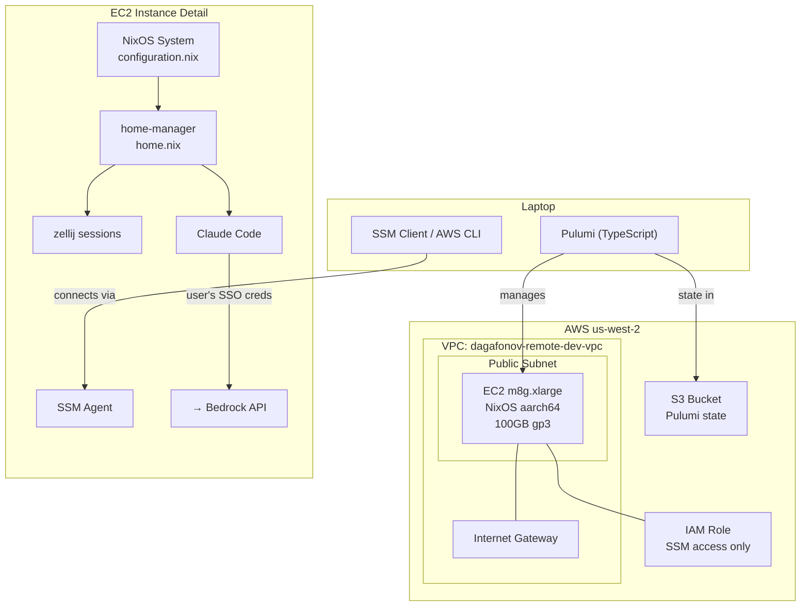

# Remote Development Environment — Design Document

## Purpose

Remote EC2 machine for persistent Claude Code agent sessions that survive laptop
disconnection. Fully declarative: AWS infrastructure via Pulumi (TypeScript),
machine configuration via NixOS + home-manager.

The primary use case: start a Claude Code agent task, close laptop, commute home,
reconnect and pick up where the agent left off. The instance runs 24/7 to support
scheduled tasks and overnight agent work.

## Glossary

| Term | Definition |
|------|-----------|
| **Pulumi** | Infrastructure-as-code tool using TypeScript to define AWS resources |
| **NixOS** | Linux distribution where the entire OS is declaratively configured via Nix |
| **home-manager** | Nix tool for declarative user-level configuration (shell, packages, dotfiles) |
| **SSM** | AWS Systems Manager Session Manager — secure shell access without SSH ports |
| **zellij** | Terminal multiplexer (tmux alternative) — keeps sessions alive across disconnects |
| **granted** | CLI tool for assuming AWS SSO roles |
| **Claude Code** | Anthropic's CLI agent for software engineering tasks |

## Project Structure

```
remote-dev/
├── README.md                    # Bootstrap steps, common commands
├── infra/                       # Pulumi project (TypeScript)
│   ├── package.json
│   ├── tsconfig.json
│   ├── Pulumi.yaml
│   ├── Pulumi.prod.yaml         # Stack config (instance type, volume size)
│   └── index.ts                 # Infrastructure definition
├── nixos/                       # NixOS flake
│   ├── flake.nix                # Inputs: nixpkgs-unstable, claude-code-nix, home-manager
│   ├── flake.lock
│   ├── configuration.nix        # System-level config
│   └── home.nix                 # home-manager user config
└── .gitignore
```

`infra/` and `nixos/` are independent. Pulumi creates the instance that runs the
NixOS config. They do not reference each other in code.

## System Map



## Component Inventory

### Pulumi Infrastructure (infra/)

| Field | Value |
|-------|-------|
| **Name** | infra |
| **Responsibility** | Provision and manage AWS resources for the remote dev environment |
| **Hides** | AWS resource creation, AMI lookup, VPC networking details |
| **Depends On** | S3 bucket (state backend, created manually), AWS account |
| **Depended On By** | NixOS config (runs on the instance Pulumi creates) |

### NixOS System Config (nixos/configuration.nix)

| Field | Value |
|-------|-------|
| **Name** | configuration.nix |
| **Responsibility** | Declare OS-level settings: EC2 integration, user account, system services |
| **Hides** | SSM agent setup, Nix settings, system-level concerns |
| **Depends On** | amazon-image.nix (NixOS EC2 module) |
| **Depended On By** | home.nix (via NixOS module integration) |

### Home Manager Config (nixos/home.nix)

| Field | Value |
|-------|-------|
| **Name** | home.nix |
| **Responsibility** | Declare user-level environment: shell, dev tools, dotfiles |
| **Hides** | Package installation, shell configuration, tool setup |
| **Depends On** | claude-code-nix flake, home-manager, nixpkgs |
| **Depended On By** | Nothing |

## AWS Resources

| Resource | Name/Details | Tags |
|----------|-------------|------|
| VPC | `dagafonov-remote-dev-vpc` | `do-not-nuke=true` |
| Public Subnet | Single AZ, auto-assign public IP | `do-not-nuke=true` |
| Internet Gateway | Attached to VPC | `do-not-nuke=true` |
| Route Table | 0.0.0.0/0 → IGW | `do-not-nuke=true` |
| Security Group | No inbound rules, all outbound allowed | `do-not-nuke=true` |
| IAM Role | `AmazonSSMManagedInstanceCore` policy only | `do-not-nuke=true` |
| Instance Profile | Wraps IAM role | `do-not-nuke=true` |
| EC2 Instance | NixOS aarch64 AMI, m8g.xlarge, 100GB gp3 | `do-not-nuke=true` |

Configurable via Pulumi config:
- `instanceType` — default `m8g.xlarge`
- `volumeSize` — default `100` (GB)

AMI is looked up dynamically (latest official NixOS aarch64 AMI) and protected
with `ignoreChanges: ["ami"]` to prevent instance replacement on subsequent runs.

No user-data: the stock NixOS AMI includes SSM agent and git by default.

## NixOS System Config

```
imports amazon-image.nix (preserves all EC2 integration)
├── networking.hostName = "dagafonov-remote-dev-machine"
├── SSM agent enabled (explicit, matches AMI default)
├── Nix settings: flakes + nix-command enabled
├── Nix binary caches: default + claude-code cachix
├── User: dagafonov, wheel group, default shell zsh
├── Locale: en_US.UTF-8, timezone UTC
└── Networking: DHCP, firewall outbound only
```

## Home Manager Config

home-manager integrated as a NixOS module (not standalone). Applied together
with system config via single `nixos-rebuild switch` command.

```
User: dagafonov
├── Claude Code — native binary via sadjow/claude-code-nix overlay
├── git
├── zsh — managed by home-manager, login shell
├── starship — prompt
├── zellij — terminal multiplexer
├── granted — AWS SSO role assumption
└── AWS CLI v2
```

## NixOS Flake Inputs

| Input | Source |
|-------|--------|
| nixpkgs | `github:NixOS/nixpkgs/nixpkgs-unstable` |
| home-manager | `github:nix-community/home-manager` (follows nixpkgs) |
| claude-code | `github:sadjow/claude-code-nix` |

## Authentication Model

- **EC2 instance role**: SSM access only (`AmazonSSMManagedInstanceCore`).
  No Bedrock permissions on the instance.
- **Bedrock access**: User authenticates via `granted` / `aws sso login` on the
  machine using their own AWS SSO profiles. Claude Code uses these credentials.
- **SSM access from laptop**: Uses the `dil-team-eevee/SandboxAdministratorAccess`
  AWS profile.

## Workflows

### First-Time Deployment

1. Create S3 bucket for Pulumi state (see README for exact commands)
2. `cd infra && pulumi login s3://<bucket-name> && pulumi up`
3. SSM into the instance
4. **Read the stock NixOS config before overwriting:**
   `cat /etc/nixos/configuration.nix` — verify your flake covers everything in it
5. Clone this repo: `git clone <repo-url> ~/remote-dev`
6. Apply: `sudo nixos-rebuild switch --flake ~/remote-dev/nixos#remote-dev`

### Daily Use

1. SSM in: `aws ssm start-session --target i-xxx`
2. `zellij attach` or `zellij` for new session
3. Work with Claude Code, close laptop whenever
4. Reconnect later: SSM in, `zellij attach`

### NixOS Config Changes from Laptop

```bash
# Edit configs locally, commit, push, then:
aws ssm send-command --instance-id i-xxx \
  --document-name "AWS-RunShellScript" \
  --parameters 'commands=["cd ~/remote-dev && git pull && sudo nixos-rebuild switch --flake ./nixos#remote-dev"]'
```

### NixOS Config Changes from Machine

```bash
# Edit configs on machine, then:
sudo nixos-rebuild switch --flake ~/remote-dev/nixos#remote-dev
git add -A && git commit -m "..." && git push
```

### Infrastructure Changes

```bash
cd infra && pulumi up
```

## Separation of Concerns

| Concern | Managed By | Changed How |
|---------|-----------|-------------|
| AWS resources exist | Pulumi | `pulumi up` from laptop |
| What's on the machine | NixOS flake | `nixos-rebuild switch` from either location |
| Sync between laptop/machine | git | commit + push/pull before applying |

## Cost

| Item | Cost |
|------|------|
| m8g.xlarge 24/7 on-demand | ~$131/month |
| 100 GB gp3 EBS | ~$8/month |
| **Total** | **~$139/month** |

## Limitations

- Instance type change requires instance stop/start (Pulumi handles this)
- EBS volume resize requires OS-level filesystem expansion after Pulumi resize
- AMI is pinned after first creation via `ignoreChanges` — intentional instance
  replacement requires manual intervention
- No auto-stop: if you stop needing the instance, you must manually stop/terminate
- No backup: NixOS config is in git, but any data on the instance that isn't
  committed is not backed up
- SSM session timeout: default 20-minute idle timeout (configurable in SSM settings)

## Decision Log

| Decision | Alternatives Considered | Rationale |
|----------|------------------------|-----------|
| Pulumi (TypeScript) over Terraform/CDK | Terraform (too low-level, already known), CDK (already known), NixOps (rough AWS support) | New tool to learn, real language, good AWS support |
| NixOS over Ubuntu+Nix | Ubuntu + Nix + home-manager | Full declarative OS — user preference for purity |
| m8g.xlarge over smaller | m8g.medium ($0.045/hr, 1 vCPU too slow), m8g.large ($0.09/hr, reasonable but limited) | Best dev experience at acceptable cost; configurable to change later |
| SSM over SSH | SSH (requires open port), mosh (requires UDP ports) | No inbound ports, no key management, built into AWS |
| On-demand over Spot | Spot (~58% cheaper) | Spot interruption kills running Claude Code sessions — defeats the core use case |
| No auto-stop | Auto-stop on idle, scheduled stop | Instance runs scheduled tasks overnight; manual management at $131/month is acceptable |
| No user-data | Minimal bootstrap user-data | Stock NixOS AMI already includes SSM agent + git; avoids override risks |
| Dynamic AMI + ignoreChanges | Hardcoded AMI ID | Convenient first-time lookup, protected from accidental replacement |
| S3 state backend | Pulumi Cloud (external dependency), local (no backup) | Self-hosted in team AWS account, versioned |
| sadjow/claude-code-nix over nixpkgs | nixpkgs claude-code-bin (lags behind) | Hourly auto-updates, native binary, cachix cache, 226 stars |
